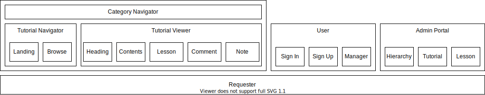

# Features
This is a tutorial sharing platform. 
- Anyone can browse the available tutorials and take any tutorial
- Members can 
    - Write new tutorials
    - Rate tutorials
    - Discuss on the lessons
    - Like/Dislike comments
    - Take notes for each lesson 
    - Track progress of each tutorial
    - Mark lessons as favourite

# Design

Each component is independent of other components, except child components get necessary data from its parent components.

## Stacks Used
Languages: JavaScript, HTML, CSS

Framework: React, Bootstrap 